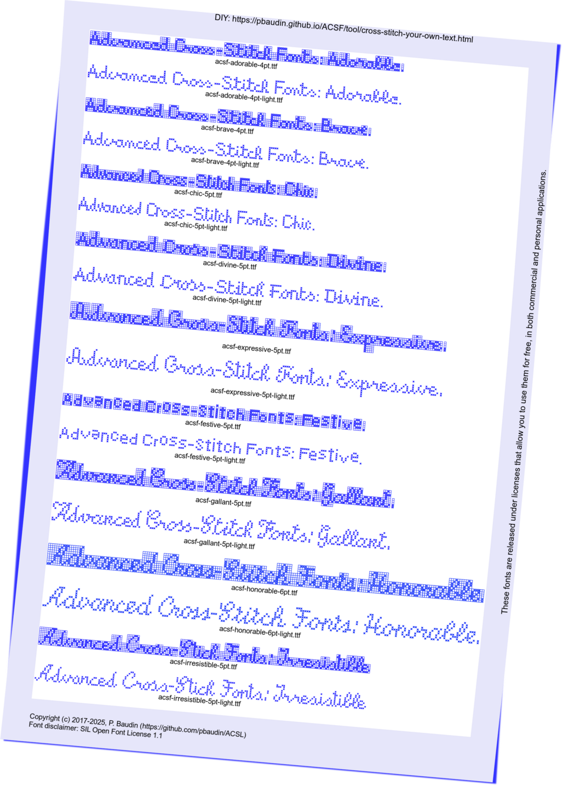

## Grid examples ##

There are some examples done using LibreOffice writer:
- A French poem by _Robert Desnos_ - [La Rose](examples/Festive-La-Rose.pdf) with the _Festive_ font
- An American poem by _Emily Dickinson_ - [A Rose](examples/Gallant-A-Rose.pdf) with the _Gallant_ font
- A cooking recipe - [French crème brûlée](examples/Gallant-French-crème-brûlée.pdf) in English with the _Gallant_ font

## Advanced Cross-Stitch Font Gallery ##

The gallery is also available in a [PDF format](examples/Advanced-Cross-Stitch-Font-Gallery.pdf).

