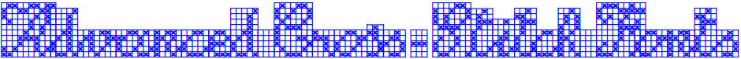

    

Copyright (C) 2017-2021, P. Baudin (https://github.com/pbaudin/ACSF)

      
      
      
    
 

# Advanced Cross-Stitch Fonts #

The cursive style offered by most of these fonts should delight all cross-stitch lovers. If anyone needs to be convinced, they just have to take a look at the [Advanced Cross-Stitch Font Gallery](examples/Advanced-Cross-Stitch-Font-Gallery.pdf).

The fonts are incomplete but contains all the letters used in the various Latin language alphabets (including diacritics), Czech letters with inverted hat, the German eszett ligature, and letters specific to certain Scandinavian alphabets.

At the start of their design (in 2017), the contextual features of the `TrueType` and `OpenType` fonts (such as `calt`, `cimf` or `ccmp`) used for ligatures was not supported by many software, including text editors and web browsers. Thanks to `LibreOffice` editors and web browsers `Firefox` and `Chrome` that support these fonts from the begining (the given `pdf` files given as examples were edited with `LibreOffice` [`Writer`](https://www.libreoffice.org/)).

## DIY: Cross Stitch your own Text ##

A demonstration tool is available inside this GitHub repository.
It allows you to create the cross-stitch chart of your own text from a web browser like `Firefox` or `Chrome`.
The tool can be used to get a quick look at the font faces and their ligatures thus designed.

Have fun with these Advanced Cross-Stitch Fonts!

### Special characters ###

These special characters are part of all Advanced Cross-Stitch Fonts.

- `~`: 1pt space
- `_`: 20pt of cross stitches  
- `$`: cuts a ligature (including kerning). For the rock'n roll font `Festive`, inserting one or more '$' at the begining of words may change their layout. You might have a look at the word `rose` into this [french poem](examples/Festive-La-Rose.pdf).

### Supported characters ###

Category | Charaters
---------|----------
Numerics | `0 1 2 3 4 5 6 7 8 9 ° / + - * %`
Uppercase | `A B C D E F G H I J K L M N O P Q R S T U V W X Y Z`
Lowercase | `a b c d e f g h i j k l m n o p q r s t u v w x y z`
Circumflex | `Â Ê Î Ô Û â ê î ô û`
Acute | `Á É Í Ó Ú á é í ó ú`
Grave | `À È Ì Ò Ù à è ì ò ù`
Dieris | `Ä Ë Ï Ö Ü Ÿ ä ï ë ö ü ÿ`
Tilde | `Ã Õ Ñ ã ñ õ`
Caron | `Č Š Ž č š ž`
Misc | `Å ẞ Ç Ø Æ Œ å ß ç æ œ ø`
Other | `¿ ? ¡ ! , ; . : ' #`

## The story ##

### Preamble ###

A web site provides from several years a `Cross Stitch Writing` tool to make a charted design out of your own text.
Some of the proposed fonts attracted my attention because most of their letters are joinable, but some letters with diacritics common to Latin alphabets are missing.
So, even in English, it is not possible to get the chart of the crème brûlée recipe from these fonts!

The last point, but not the least, concerns the terms of use of that tool.
They do not allow you to distribute the charts that you produced with this tool to your friends, even for free!

That was the starting point of this project.
The design of cursive cross-stitch fonts without such a restriction would delight most of the cross-stitch lovers.

The first fonts are derived from the volume 1 of the book `Cross stitch letters BIBLE des lettres au point de croix` (authored by Valérie LEJEUNE - EAN 9782756503059) which references many alphabet primers (about 800).
Since all of them were published before 1930, these patterns are in the [public domain](https://en.wikipedia.org/wiki/Public_domain).
In order to share this common cultural work with all, the [SIL Open Font License](https://scripts.sil.org/ofl) version 1.1 ([OFL 1.1](https://scripts.sil.org/OFL_web)) applies to the Advanced Cross-Stitch Fonts.

### Development ###

A cursive font requires to design a lot of glyphs with a lot of ligatures, and this is especially true the smaller the font size (i.e. lowercase from 4 to 5 points high).
So it is recommanded to use a tool to create such a font.

The first designed font was build in scripting [`FontForge`](https://fontforge.org/docs/scripting/python.html) with the `Python 2` API in 2017.
`Python` is a dynamically typed language since the types are defined from values ​​obtained at runtime.
That allows rapid code development.
With this software, it was possible to design the two first fonts involving only ligature pairs and kerning pairs, but that is too restrictive.

To handle more complex fonts, it is necessary to use contextual `TrueType` (or `OpenType`) features.
A new version of that sofware was writen in [`Ocaml`](https://ocaml.org/) to manage these features in using
the [`Lymp`](https://github.com/dbousque/lymp) library allowing you to use `Python` functions and objects of `FontForge` API from `OCaml` world.
That software version contains an `Ocaml` layer performing the bindings to `FontForge`.
The `FontForge` API imposes type constraints between the arguments of the functions managing the contextual font tables.
On order to offer an `Ocaml` API as close as the `FontForge` API, the use of [Generalized Algebraic Data Type](https://caml.inria.fr/pub/docs/manual-ocaml/gadts.html) of `Ocaml` was seen as an oppotunity.
That has not been so much used due to some bugs of the `Lymp` library raised by the hudge numbers of calls from `Ocaml` to `Python`.
A work around has been found in generating an intermediate file (specifying the [`OpenType Feature Data`](https://opentypecookbook.com/putting-it-together/) to use in a `.fea` file) to build the final fonts from `FontForge Python` API and the `Ocaml` bindings.

In the meantime, `Fontforge` API migrated to `Python 3` and the `Lymp` library was no more able to perform the binding with newer versions of `Ocaml` compiler and various libraries.
Nevertheless, with few effort the `Lymp` library was easily replaced by the [`PyMl`](https://github.com/thierry-martinez/pyml) library.

    

